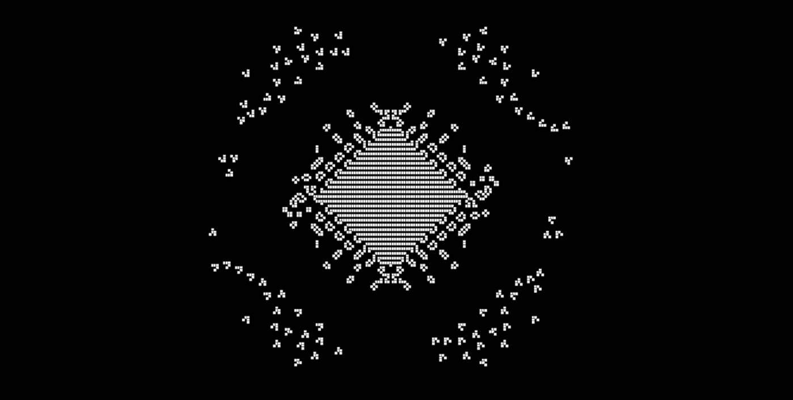

# conway
Conway's Game of Life using p5.js.

## What is Conway's Game of Life?

Conway's Game of Life is a binary, zero-player game played on an infinite grid of squares or cells.

The game starts with a decided seed or pattern that will evolve and change until it repeats the previous step.

On each step, each cell dies, comes alive, or stays alive.
 - A live cell with 2 or 3 neighbors stays alive
 - A live cell with less than 2 neighbors dies.
 - A live cell with more than 3 neighbors dies.
 - A dead cell with *exactly* 3 neighbors comes alive.

# More screenshots

